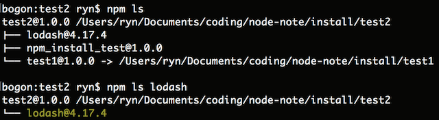
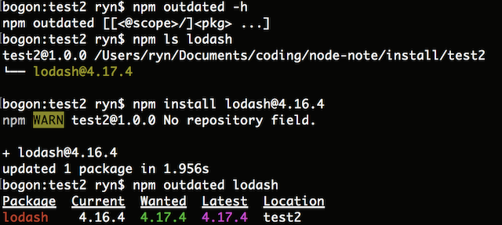
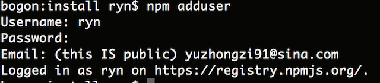
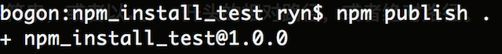
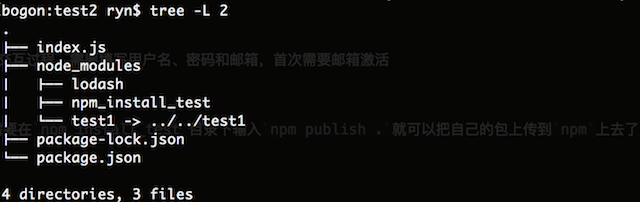

## 安装包

### 本地安装

```javascript
npm install webpack
```
安装完成之后，`npm`会在当前目录创建一个`node_modules`文件夹，并将从`npm`仓库下载下来的`webpack`包解压到`node_modules`文件夹中

【调用】

```javascript
var webpack = require('webpack');
```
### 全局安装

添加`-g`参数，`npm`会将包安装在用户目录下，可以使用`npm root -g`来查看全局安装目录：

```javascript
npm root -g

> /usr/local/lib/node_modules
```

需要当作工具的全局安装的模块，在目录下都会有一个`bin`目录，里面存放在执行的命令，例如`webpack`下，就会有一个`bin`文件夹，同时在`package.json`文件中，会有一个选项`bin: { 'webpack': './bin/webpack.js' }`，在执行时，输入`webpack`命令，根据全局安装目录找到当前安装在全局下的包中对应的命令。

### 其他安装

无法直接从`npm`安装的包，可以尝试其他方式，只需要在当前的文件夹中的`package.json`中指名要下载的包的位置就好。可以是一个包含`package.json`的存档文件，也可以是一个URL地址，也可以是一个目录下有`package.json`文件的目录位置：

```javascript
npm install <tarball file>
npm install <tarball url>
npm install <folder>
```

例如从在`test2`中需要用都`test1`作为模块依赖，我们可以这样来操作：

```javascript
npm install ../test2
```

在`package.json`文件的依赖中会添加这样一行，在`test2`文件夹中的`node_modules`文件夹中会出现一个名为`test1`的包文件，实际上是一个指向`test1`包的软连接

```javascript

"dependencies": {
    "test1": "file:../test1"
}
```

【指定镜像源】

如果发现采用国外`npm`镜像源安装包太慢，可以尝试切换为国内的淘宝镜像源，具体如下：

```javascript
npm install webpack --save-dev --registry=https://registry.npm.taobao.org/
```

### 安装指定版本

默认从npm安装的包都是最新的，例如：

```javascript
npm install webpack
```

如果需要安装指定版本，可以在包后面加上`@版本号`

```javascript
npm install webpack@2.8.7
```

### 生产依赖和开发依赖

如果包需要在开发时候用到，比如工具类使用的，可以在安装的时候将信息加入到`devDependencies`（开发阶段的依赖）

```javascript
npm install webpack --save-dev 

// 或
npm install webpack -D
```

如果需要在发布的时候用到的库文件，就需要将信息加入到`dependencies`中，如果我们使用`react`开发项目，那么`react`和`react-dom`就是项目必须的

```javascript
npm install react react-dom --save

// 或
npm install react react-dom -S
```

## 查看包

### 查看当前项目安装的包

```javascript
npm ls

// 要查看全局使用的情况
npm ls -g

// 查看指定包信息
npm ls lodash
```



### 查看一个指定包的信息

```javascript
npm info lodash
```

### 检测过时

```javascript
npm outdated lodash
```

注意：如果当前版本是最新的，控制台将不会有任何打印信息，如下我将`lodash`由最新版本变为`4.16.4`之后，再使用这个命令，就会出现下面的情况：



### 更新与卸载

通过命令`npm update <pkg>`来更新包

```javascript
npm update lodash
```

通过命令`npm uninstall [<@scope>/]<pkg>[@<version>]... [--save-prod|--save-dev|--save-optional] [--no-save]`来卸载包

```javascript
npm uninstall lodash --save-dev
```

## 制作包并上传到npm

`node`遵循了`CommonJs`的文件规范来编写相应模块，`CommonJs`规范主要有三个方面：

- 模块引用

```javascript
var math = require("math");
```


- 模块定义

`CommonJs`规定了每一个文件即是一个模块，模块之间通过`require`的方式来相互引用。一个模块中包含有一个内置的`module`对象，指向自身，在这个对象中包含有许多内置属性，例如：`exports`,`filename`等等。每一个模块通过`module.exports`来导出模块内容，同时在模块内部的`exports`指向了模块本身的`exports`属性，即`module.exports === exports`

可以尝试把这些东西打印出来

```javascript
console.log("I'm Test1");

var result = module.exports === exports;
console.log(result);

console.log(module);
console.log(require);
console.log(exports);

```

- 模块标识

即`require`方法的参数，它必须是符合小驼峰命名的字符串，或者以.、..开头的相对路径，或者绝对路径。

### 编写模块

可以看到下图，这里十分简单的一个包，`index.js`就是一个模块，里面编写了一个打印语句

```javascript
console.log("I'm from npm");
```


### 初始化包描述文件

就是编写`package.json`文件。我们不需要手动编写，`npm`已经有相关的命令来共我们使用，在`npm_install_test`目录下，输入`npm init`会自动生成一个`package.json`文件，其中只需要填写一些必要的信息就好，其他的可以直接回车

### 注册包仓库帐号

注册账号的命令是`npm adduser`，这是一个提问式的交互过程，需要填写用户名、密码和邮箱，首次需要邮箱激活



### 上传包

上传包的命令是`npm publish <folder>`，我们只需要在`npm_install_test`目录下输入`npm publish .`就可以把自己的包上传到`npm`上去了。



### 安装自己上传的包

```javascript
cd test2
npm install npm_install_test
```




