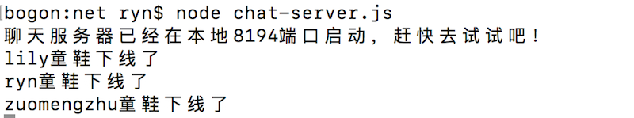
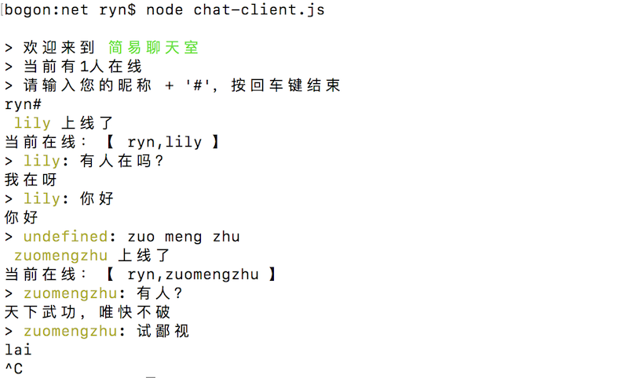
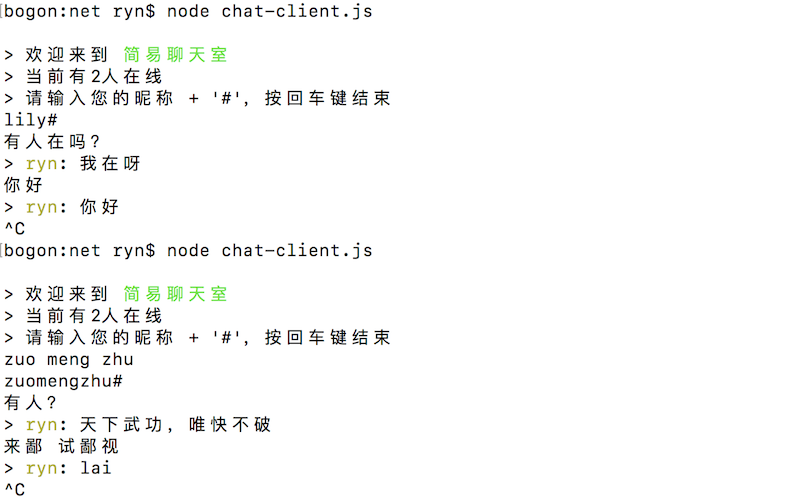
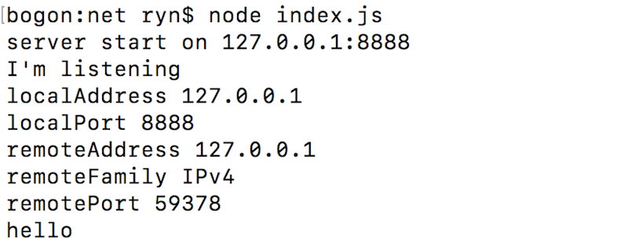
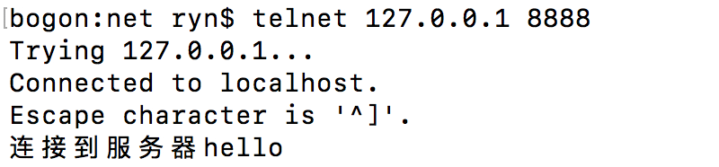

## 简易聊天室

运行：

```javascript
node chat-server.js
node chat-client.js
```

net模块是同样是nodejs的核心模块。在http模块概览里提到，http.Server继承了net.Server，此外，http客户端与http服务端的通信均依赖于socket（net.Socket）。也就是说，做node服务端编程，net基本是绕不开的一个模块。

从组成来看，net模块主要包含两部分，了解socket编程的同学应该比较熟悉了：

- net.Server：TCP server，内部通过socket来实现与客户端的通信。

- net.Socket：tcp/本地 socket的node版实现，它实现了全双工的stream接口

### 一个小例子

服务器端：


```javascript
var net = require('net');

var clientList = [];

var server = net.createServer(function(socket) {
    clientList.push(socket);

    socket.write(
        '\n> 欢迎来到\033[92m 简易聊天室 \033[39m'
        + '\n> 当前有' + clientList.length + '人在线'
        + '\n> 请输入您的昵称 + \'#\'，按回车键结束'
    );

    function boardcast(clientList, msg, type) {
        if (type === 'name') {
            var users = clientList.map(function(client, index) {
                return client.name;
            });
        }
        
        // 通知用户上线了
        for (var i = 0; i < clientList.length; i++) {
            if (socket !== clientList[i]) {
                if (type === 'name') {
                    clientList[i].write(msg + '\n当前在线：【 ' + users.join(',') + ' 】');
                } else {
                    clientList[i].write(msg);
                }
            }
        }
    }

    socket.on('data', function(chunk) {
        var data = chunk.toString('utf8');

        // 输入昵称
        if (data.indexOf('#') !== -1) {
            var nickName = data.split('#')[0];
            if (!socket.name) {
                socket.name = nickName;
                boardcast(clientList, '\033[33m '+ nickName +' \033[39m上线了', 'name')
            }
        } else {
            boardcast(clientList, '> \033[33m' + socket.name + '\033[39m: ' + data.replace('\n', ''));
        }
    });

    socket.on('close', function() {
        var index = clientList.indexOf(socket);
        clientList.splice(index, 1);
        console.log(socket.name + '童鞋下线了');
    });

    socket.on('error', function(err) {
        console.log('服务器遇到了一个不知名的错误，正在抢救中...');
    });
    
});

server.listen(8194, function() {
    console.log('聊天服务器已经在本地8194端口启动，赶快去试试吧！');
});
```

客户端：

```javascript
var net = require('net');

process.stdin.resume();
process.stdin.setEncoding('utf8');

var client = net.connect({ port: 8194 }, function() {

    process.stdin.on('data',function(data) {
        client.write(data);
    })

    client.on("data", function(data) {
        console.log(data.toString());
    });

    client.on('end', function() {
        console.log('【本机提示】退出聊天室');
        process.exit();
    });
    client.on('error', function() {
        console.log('【本机提示】聊天室异常');
        process.exit();
    });
});
```
**server**



**client1**



**client2**



### 常规操作

#### server监听事件

- close 

当server关闭的时候触发. 注意,如果connections存在, 直到所有的connections结束才会触发这个事件

- listening

当服务被绑定后调用 server.listen().

- error

当错误出现的时候触发. 不同与 net.Socket, 'close' 事件不会在这个事件触发后继续触发 除非 server.close() 是手动调用.

#### server方法

- listen

为 connections 启动一个 server 监听. 一个 net.Server 可以是一个 TCP 或者 一个 IPC server，这取决于它监听什么。

可能的参数:

- server.listen(handle[, backlog][, callback])

- server.listen(options[, callback])

- server.listen(path[, backlog][, callback]) for IPC servers

- server.listen([port][, host][, backlog][, callback]) for TCP servers

这个函数是异步的。当 server 开始监听，'listening' 事件会触发。最后一个参数 callback 将会被添加为'listening' 事件的监听器。

- colse

停止 server接受建立新的connections并保持已经存在的connections.此功能是异步的,当所有的connections关闭同时server响应 'close'事件的时候,server将会最终关闭. 一旦'close'发生将会调用可选的回调函数. 与该事件不同, 如果服务器在关闭时未打开，则将使用错误作为唯一参数。

#### socket 事件

- close

当socket关闭的时候触发

- data

当收到数据的时候触发，收到的数据可能是是一个`Buffer`或者是`字符串`，可以通过`socket.setEncoding(encoding)`来设置接收数据的编码。

如果有数据收到，但是没有监听这个事件，那么之前的数据就会被丢弃掉

- drain

如果缓冲区中的数据被读完时触发，可以触发写的操作

- end

半关闭socket。例如，它发送一个FIN包。可能服务器仍在发送数据。

如果参数data不为空，等同于调用socket.write(data,encoding)后再调用socket.end()

- error

错误发生时触发

#### socket 方法/属性

- 属性

bufferSize/bytesRead/bytesWritten/distoryed/localAddress/localPort

- 方法

end()/pause()/resume()/write()

```javascript
var net = require('net');

const PORT = 8888;
const HOST = '127.0.0.1';

var server = net.createServer(function(socket) {

    console.log('localAddress', socket.localAddress);
    console.log('localPort', socket.localPort);

    console.log('remoteAddress', socket.remoteAddress);
    console.log('remoteFamily', socket.remoteFamily);
    console.log('remotePort', socket.remotePort);

    socket.setEncoding('utf8');

    socket.write('连接到服务器');

    socket.on('data', function(chunk) {
        console.log(chunk.toString());
    });

    socket.on('error', function() {
        console.log('An error occur');
        socket.close();
    });

    socket.on('close', function() {
        console.log('socket closed');
    });
});

server.listen(PORT, HOST, function() {
    var address = server.address();
    console.log('server start on ' + HOST + ':' + PORT);
});

server.on('listening', function() {
    console.log("I'm listening");
});

server.on('close', function() {
    console.log('Server closed');
});

server.on('error', (e) => {
    if (e.code === 'EADDRINUSE') {
        console.log('Address in use, retrying...');
        setTimeout(() => {
            server.close();
            server.listen(PORT, HOST);
        }, 1000);
    }
});
```
**server**



**client**



### drain/pause/resume

这三个事件一般用在流当中，例如下面简单的文件拷贝：

```javascript
var fs = require('fs');
var readStream = fs.createReadStream('a.txt');
var writeStream = fs.createWriteStream('aa.txt');

//读取数据
readStream.on('data',function(chunk){
    //如果读取的数据还在缓存区，还没有被写入
    if(writeStream.write(chunk) === false){
        //停止读数据
        readStream.pause();
    }
});

//如果数据读取完成
readStream.on('end',function(chunk){
    //停止写入数据
    writeStream.end();
});

//如果缓存区的数据被消耗完
writeStream.on('drain',function(){
    //接着读取数据
    readStream.resume();
});
```

简单写法：

```javascript
var fs = require('fs');
var readStream = fs.createReadStream('a.txt');
var writeStream = fs.createWriteStream('aa.txt');
readStream.pipe(writeStream);
```


